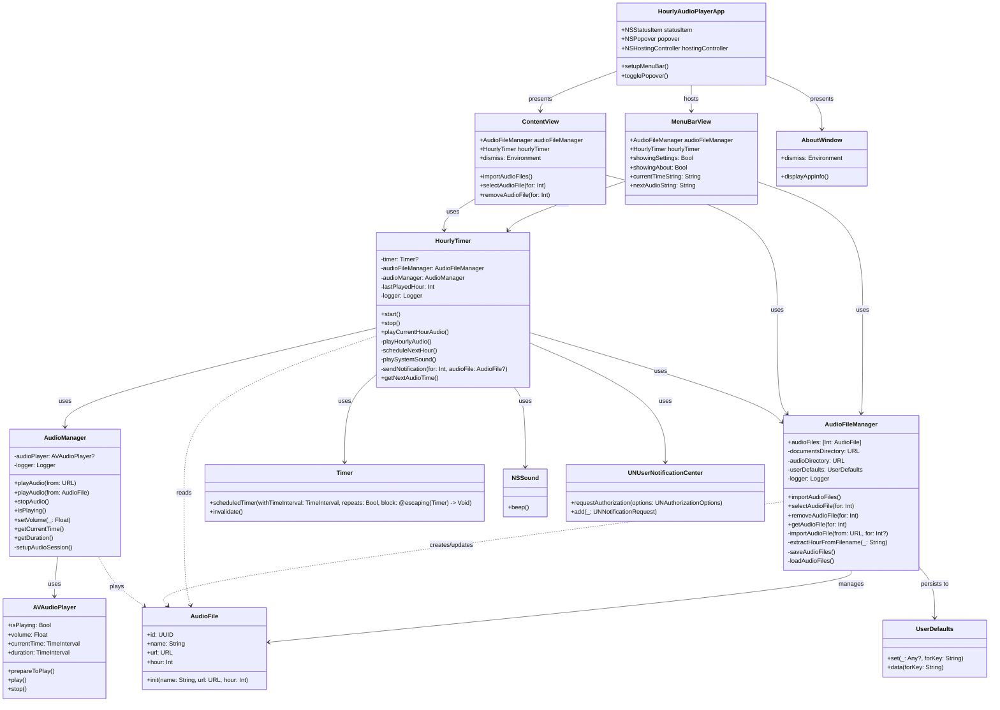

# Hourly Audio Player

A macOS menu bar application that plays custom audio files at the top of each hour, helping you stay aware of time throughout your day.

## 🎵 Features

- **Hourly Audio Reminders**: Automatically plays audio at the top of each hour
- **Custom Audio Files**: Import and assign different audio files for different hours
- **System Sound Fallback**: Plays default macOS system sound when no custom audio is set
- **Menu Bar Integration**: Clean, accessible interface from your menu bar
- **Test Functionality**: Test audio playback for the current hour
- **Settings Management**: Easy audio file import and hour assignment
- **Professional UI**: Safari-style About window and intuitive design

## 🏗️ Architecture

### System Overview

```
┌─────────────────────────────────────────────────────────────┐
│                    macOS Menu Bar                          │
│  ┌─────────────────────────────────────────────────────┐   │
│  │              HourlyAudioPlayerApp                   │   │
│  │  ┌─────────────────┐  ┌─────────────────────────┐  │   │
│  │  │   NSStatusItem  │  │      NSPopover          │  │   │
│  │  │   (Menu Icon)   │  │   (MenuBarView)         │  │   │
│  │  └─────────────────┘  └─────────────────────────┘  │   │
│  └─────────────────────────────────────────────────────┘   │
└─────────────────────────────────────────────────────────────┘
                                │
                                ▼
┌─────────────────────────────────────────────────────────────┐
│                    Core Components                          │
│                                                             │
│  ┌─────────────────┐  ┌─────────────────┐  ┌─────────────┐ │
│  │  HourlyTimer    │  │ AudioFileManager│  │ AudioManager│ │
│  │                 │  │                 │  │             │ │
│  │ • Timer Logic   │  │ • File Import   │  │ • Playback  │ │
│  │ • Scheduling    │  │ • Storage       │  │ • Controls  │ │
│  │ • Notifications │  │ • Hour Mapping  │  │ • Volume    │ │
│  └─────────────────┘  └─────────────────┘  └─────────────┘ │
└─────────────────────────────────────────────────────────────┘
                                │
                                ▼
┌─────────────────────────────────────────────────────────────┐
│                    User Interface                           │
│                                                             │
│  ┌─────────────────┐  ┌─────────────────┐  ┌─────────────┐ │
│  │  MenuBarView    │  │   ContentView   │  │ AboutWindow │ │
│  │                 │  │                 │  │             │ │
│  │ • Main Menu     │  │ • Settings      │  │ • App Info  │ │
│  │ • Status Info   │  │ • File Import   │  │ • Contact   │ │
│  │ • Quick Actions │  │ • Hour Config   │  │ • Version   │ │
│  └─────────────────┘  └─────────────────┘  └─────────────┘ │
└─────────────────────────────────────────────────────────────┘
```

### UML Architecture Diagram



### Component Details

#### **HourlyTimer**
- **Purpose**: Core scheduling and timing logic
- **Responsibilities**:
  - Calculate time until next hour
  - Schedule timer events
  - Trigger audio playback
  - Send notifications
  - Handle system sound fallback

#### **AudioFileManager**
- **Purpose**: Audio file management and storage
- **Responsibilities**:
  - Import audio files from user selection
  - Store files in app's Documents directory
  - Map audio files to specific hours
  - Persist configuration using UserDefaults
  - Validate file existence

#### **AudioManager**
- **Purpose**: Audio playback control
- **Responsibilities**:
  - Play audio files using AVAudioPlayer
  - Handle audio session setup
  - Control volume and playback state
  - Manage audio file loading

#### **User Interface Components**
- **MenuBarView**: Main popover interface with status and controls
- **ContentView**: Settings window for audio file management
- **AboutWindow**: Custom Safari-style about dialog

## 🚀 Getting Started

### Prerequisites

- macOS 14.0 or later
- Xcode 15.0 or later (for development)

### Installation

1. **Clone the repository**:
   ```bash
   git clone https://github.com/cycleruncode/HourlyAudioPlayer.git
   cd HourlyAudioPlayer
   ```

2. **Build and run**:
   ```bash
   ./build_and_run.sh
   ```

3. **Or build for release**:
   ```bash
   ./build_release.sh
   ```

### Usage

1. **Launch the app**: The app will appear as an icon in your menu bar
2. **Configure audio files**: Click the menu bar icon → "Open Settings"
3. **Import audio files**: Use "Import Audio Files" or "Select Audio File" for specific hours
4. **Test audio**: Use "Test Current Hour" to verify audio playback
5. **Automatic playback**: Audio will play automatically at the top of each hour

## 🎛️ Configuration

### Supported Audio Formats
- MP3
- WAV
- M4A
- AIFF
- Any format supported by macOS AVFoundation

### File Organization
- Audio files are stored in `~/Documents/HourlyAudioPlayer/`
- Files are automatically copied from their original location
- Hour mapping is stored in UserDefaults

### Hour Assignment
- Audio files can be assigned to specific hours (0-23)
- Filename patterns are automatically detected (e.g., "12hour.mp3", "12.mp3")
- Manual assignment available through the settings interface

## 🛠️ Development

### Project Structure
```
HourlyAudioPlayer/
├── HourlyAudioPlayerApp.swift      # Main app entry point
├── MenuBarView.swift               # Menu bar popover interface
├── ContentView.swift               # Settings window
├── AboutWindow.swift               # About dialog
├── HourlyTimer.swift               # Core timing logic
├── AudioFileManager.swift          # File management
├── AudioManager.swift              # Audio playback
├── Assets.xcassets/                # App icons and assets
├── Info.plist                      # App configuration
├── HourlyAudioPlayer.entitlements  # App permissions
├── build_and_run.sh                # Development build script
├── build_release.sh                # Release build script
└── generate_icons.sh               # Icon generation script
```

### Build Scripts

#### Development Build
```bash
./build_and_run.sh
```
- Cleans previous build
- Builds in Debug configuration
- Launches the app

#### Release Build
```bash
./build_release.sh
```
- Builds in Release configuration
- Creates .app bundle
- Generates .dmg installer
- Creates .zip archive
- Generates release notes

### Key Technologies
- **SwiftUI**: Modern declarative UI framework
- **AVFoundation**: Audio playback and file handling
- **UserNotifications**: System notifications
- **AppKit**: macOS-specific UI components
- **os.log**: Structured logging system

## 📋 Contributing

We welcome contributions! Here's how you can help:

### 🐛 Bug Reports

**Before submitting a bug report, please check:**
- [ ] The issue hasn't been reported already
- [ ] You're using the latest version
- [ ] The issue is reproducible

**When reporting a bug, please include:**
- macOS version
- App version
- Steps to reproduce
- Expected behavior
- Actual behavior
- Screenshots (if applicable)
- Console logs (if relevant)

**Submit bug reports to:**
- **Email**: support@cycleruncode.club
- **Subject**: `[Bug Report] Brief description`

### ✨ Feature Requests

**Before submitting a feature request, please check:**
- [ ] The feature hasn't been requested already
- [ ] The feature aligns with the app's purpose
- [ ] You can provide a clear use case

**When requesting a feature, please include:**
- Clear description of the feature
- Use case and benefits
- Mockups or examples (if applicable)
- Priority level (Low/Medium/High)

**Submit feature requests to:**
- **Email**: support@cycleruncode.club
- **Subject**: `[Feature Request] Brief description`

### 🔧 Enhancement Proposals

**For code improvements, please include:**
- Current implementation issues
- Proposed solution
- Benefits and trade-offs
- Implementation approach
- Testing considerations

**Submit enhancement proposals to:**
- **Email**: support@cycleruncode.club
- **Subject**: `[Enhancement] Brief description`

### 🏗️ Code Contributions

**Development workflow:**
1. Fork the repository
2. Create a feature branch
3. Make your changes
4. Test thoroughly
5. Submit a pull request

**Code standards:**
- Follow Swift style guidelines
- Add comments for complex logic
- Update documentation as needed
- Ensure all tests pass

## 📞 Support & Contact

- **Website**: https://cycleruncode.club
- **Support Email**: support@cycleruncode.club
- **Issues**: Email support@cycleruncode.club

## 📄 License

MIT License

Copyright (c) 2025 CycleRunCode

Permission is hereby granted, free of charge, to any person obtaining a copy
of this software and associated documentation files (the "Software"), to deal
in the Software without restriction, including without limitation the rights
to use, copy, modify, merge, publish, distribute, sublicense, and/or sell
copies of the Software, and to permit persons to whom the Software is
furnished to do so, subject to the following conditions:

The above copyright notice and this permission notice shall be included in all
copies or substantial portions of the Software.

THE SOFTWARE IS PROVIDED "AS IS", WITHOUT WARRANTY OF ANY KIND, EXPRESS OR
IMPLIED, INCLUDING BUT NOT LIMITED TO THE WARRANTIES OF MERCHANTABILITY,
FITNESS FOR A PARTICULAR PURPOSE AND NONINFRINGEMENT. IN NO EVENT SHALL THE
AUTHORS OR COPYRIGHT HOLDERS BE LIABLE FOR ANY CLAIM, DAMAGES OR OTHER
LIABILITY, WHETHER IN AN ACTION OF CONTRACT, TORT OR OTHERWISE, ARISING FROM,
OUT OF OR IN CONNECTION WITH THE SOFTWARE OR THE USE OR OTHER DEALINGS IN THE
SOFTWARE.

## 🗺️ Roadmap

### Planned Features
- [ ] Volume control per hour
- [ ] Audio file preview
- [ ] Custom notification sounds
- [ ] Snooze functionality
- [ ] Multiple audio profiles
- [ ] Integration with system calendar
- [ ] Widget support
- [ ] Shortcuts app integration

### Known Issues
- None currently reported

---

**Made with ❤️ by CycleRunCode**
